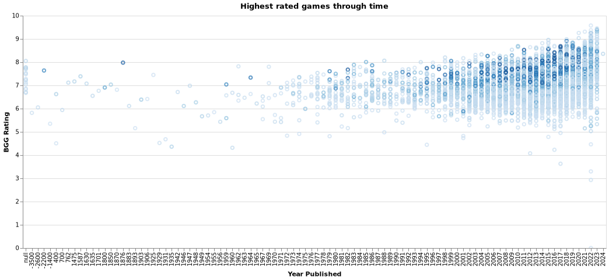

# Board game analysis
_2022 November_

Data + this guy is on vacation = Analysis!

You should be reading this on [this page](https://nraw.github.io/board_games_analysis/) so that links correctly follow to the charts!
And on that note, click on any of the charts for the interactive versions with hover tooltips! Ooooh... tooltips...!

## What are the best games out there?

The definition of "Best game" is not as easy to define as one would hope. A simple rating sort would inevitably put some barely rated games very high, not to mention the fact that expansions and newer editions tend to be better rated than the base games. I strived to approximate the best game metric, by observing metrics such as best rated and most wished.

## Wished vs owned?

I chose most wished as one of the most important metrics, but owned could also be on that list. Intuitively, the game everybody has would surely be the best game out there, right? 

The problem with owned games is that a game doesn't have to be good for people to put it on their owned list. In my analysis, I wanted to check what people want to have, rather than what they own. This leaves out from it omni-present games like Uno, Scrabble and Monopoly. 

A problem with the wished definition is bias towards expensive games. It's more likely for people to put expensive games on their wishlist than games that they can simply just go and buy. To give an example, [Too Many Bones](https://www.youtube.com/watch?v=Gr43RVRtv8s) sits at approx 8k owned copies. This makes it an averagely owned game (of the games with at least 100 owned copies). However, with a near equal amount of presence on the wishlist with around 6k copies, it is one of the top wished for games.

## Which games have the most skewed trading/wanting ratio?

I find it funny but, in all honesty, fully expected that the game people want to get rid of the most is Munchkin, one of the most popular betrayal focused games.

### Is there a connection between playtime and weigth (complexity)?

The Board Game Geeks use a [weight](https://boardgamegeek.com/wiki/page/Weight) metric to estimate how complex a game is. There is no strict definition of it, but there should be a connection with the duration of the game.

## Are more difficult games higher rated?

Yup.

## What are the best games depending on number of players?

A shocker here was in the 10 people category. The hell is the [North African Campaign](https://youtu.be/-Lb9s6d8bJo?t=197) game...
## Playtime analysis
### What are the best games based on playing time?

Sometimes there's a need for easier and quicker games. These are commonly referred to as filler games, since they are usually played as a side to a main game of a gaming evening.
Some notable games:
- 1 minute:
    - [Happy Salmon](https://www.youtube.com/watch?v=aeT2qssQii8) is... a happy salmon game
- 5 minutes:
    - [Inhuman conditions](https://www.youtube.com/watch?v=pLR6yGVJs0Y) is a surreal interrogation game
    - [5-minute Marvel](https://www.youtube.com/watch?v=PZx1k0DmfjU) is a fast cooperative dungeon clearing game
- 10 minutes:
    - [FUSE](https://www.youtube.com/watch?v=932eBqMSf64) is a game where you cooperatively defuse bombs
    - [KLASK](https://www.youtube.com/watch?v=ZTpPzAzzwyU) looks super entertaining although maybe looks more like a toy?
- 15 minutes:
    - [Codenames](https://www.youtube.com/watch?v=3UEbi7GWMPg) is a quite popular party game
- 20 minutes:
    - [The Crew: The Quest for Planet Nine](https://www.youtube.com/watch?v=D7efIcZFMp8) is a cooperative trick taking game
    - [Santorini](https://www.youtube.com/watch?v=H7oRu8QuEMc) is a simple and charming abstract game

### What are the longest games?
We meet a masterpiece once again. The same game that occupied the top game for 10 players, is joining us again for longest game award (at least the ones that seem to have some following). Apparently, the North African Campaign packs a whooping 1000 hours of estimated playtime.

Most of these games are part of the Advanced Squad Leader (ASL). As for the rest, it's hard to take them seriously, alas, here they are. And if someone ever asks you how long the longest game on BGG is... well, it's [half a million hours long](https://boardgamegeek.com/boardgame/311320/office-space-game).

## Who are the best designers, artists? Who produced the most?
On a first glance, one would assume that a good designer or artist is one that produces many good rated games. The charts below observe these two metrics

### Designers

### Artists

## Which are the publishers with the most games?

## What are the most and least common categories? What are the best games per category?

This is where personal preferences come into play. Check the category you like the most and find the games that might be of your interest.

For example, I found
- an interesting story driven pirates game: [Forgotten Waters](https://boardgamegeek.com/boardgame/302723/forgotten-waters)
- Or this religious beauty: [Virgin Queen](https://www.youtube.com/watch?v=86pIbGeBJPQ)

Having checked negotiation games and found out about [Dune](https://www.youtube.com/watch?v=O6BKjk_2UTE) which looks like a jewel and having watched the linked video about it, we found out about [War of the Ring](https://www.youtube.com/watch?v=MvgooNB8Ck0) which seems like an awesome 2 player war game.

Under the Maze category we found [Burgle Bros](https://www.youtube.com/watch?v=XLeYbGKf0aY) which might be an awesome cooperative game!

A party game that sparked my attention was [Deception: Hong Kong](https://www.youtube.com/watch?v=CDWvHrt6kG0) and [The Resistance: Avalon](https://www.youtube.com/watch?v=rXlK3NZjLGc) looks very sneaky.
I've played [Just one](https://www.youtube.com/watch?v=PG5QE_YUw1E) and [Monikers](https://www.youtube.com/watch?v=yvdpPc5ZVlE) before, but didn't catch their names, so this research helped me with that!

## What are the most common mechanics? What are the best games per mechanic?

Similarly to the categories, I can only speak to my own game searching adventure here.

[The King's Dilemma](https://www.youtube.com/watch?v=XaTHH7xDRqE) sticks out to me in the negotiation games (which seems to be both a mechanic and a category..). It's a legacy game for 5 people where you fight over a kingdom!

## Which games have the most expansions?
Carcassone? Bang? Magic the Gathering?
Well.. sort of, but they are shadowed by games like Advanced Squad Leader with a whooping 456 expansions.

## Dice Tower Certificate of Excellence and Shut up & Sit Down Recommendations

An alternative way of fidning games can be by looking at recommendations of people that have played and reviewed a sea of games already. Personally, my go to are the [Dice Tower](https://www.dicetower.com/) and [Sit Down & Shut Up](https://www.shutupandsitdown.com/). So here's a quick overview of the games they recommend.

All of these games have a guarantee to be among the best games out there, so checking them out shouldn't be a waste even if the games are outside of your games of interest.

## Highest rated games through time

From the chart above it appears that the average rating is going up throughout time. However, bear in mind that this analysis was done in 2020, while the last two columns are for 2021 and 2022. My assumption is that these games are the ones that are hyped enough to get a following months before being published. At this stage, they are most likely being rated predominately by fans or kickstarter supporters.

## Games available on Board Game Arena

For those unaware, you can play board games online for free on [Board Game Arena](https://boardgamearena.com). Or well, you can play most of those games for free, as others might only available for premium users. Still cool though!

## Suggestions?

Feel free to join [the discussions page!](https://github.com/nraw/board_games_analysis/discussions)

---

# Appendix of my random thoughts

## What consitutes a game?
Since some of the quantitative numbers focused on number of games, I realised there might be some weird scenarios that require some more thought. Is just a refurbishing of a game a new game? Is a lighter version of it, or a spin off a new game or is it basically the same? 

It's not the easiest decision to make to decide what should consist of a game so in some cases I applied the following assumptions:
- I decided that I don't count expansions, they are part of the same game.
- I don't count different editions, they are the same game.
- I don't count reimplementations where I managed to identify these.
- When there was a family of games, I only took the most popular (the one with the most `usersratings`) as I considered that to be the flagship of the games. This allowed me to drop various spin-offs of the same game.
- In many of the stats I also did a cut of games that either had a certain amount of ratings or that were wished by at least a certain amount of people. The goal here is to weed out games that are either too new or not relevant enough to count as statistics. Apologies if your very niche game did not appear where you wanted to see it, but already with these the charts were massive.

## Possible additional analysis
- Which games have the most implementations?
- Most diverse creators (most different categories/mechanics x ratings per creator)
    - combo? artists that worked with most designers, publishers?

