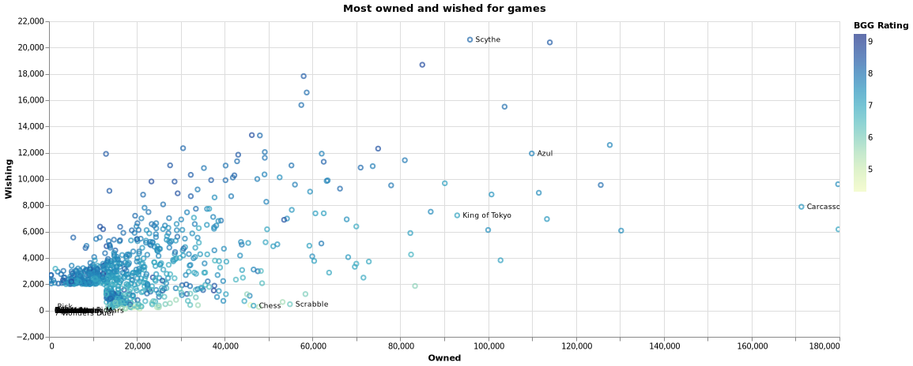
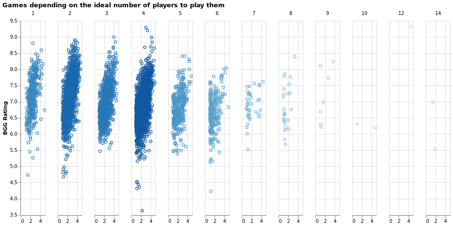
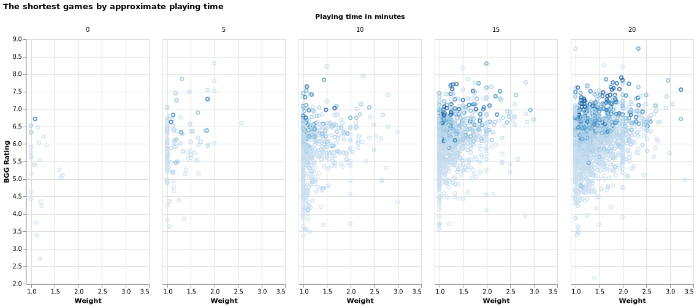
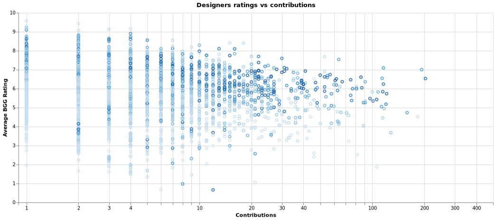
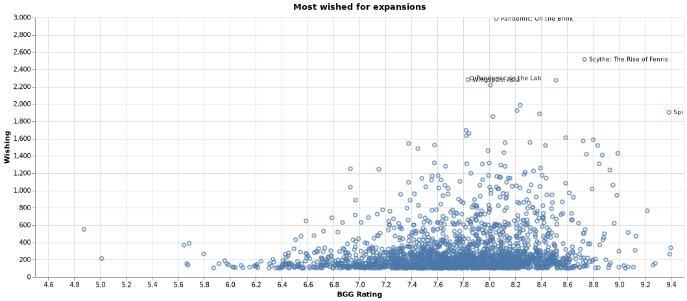

# Board game analysis

## What are the highest rated games?

## Which games are most wished for?

### Highest by year

## Wished vs owned?

The definition of "Best game" is hard to define. In order to aproximate that metric, I strived towards combining metrics such as best rated and most wished, but owned could also be on that list. Intuitively, the game everybody has, would surely be the best game out there, right? 

The problem with owned games is that a game doesn't have to be good for people to put it on their owned list. In my analysis I wanted to check what people want to have, rather than what they own. This leaves out from the analysis omni-present games like Uno, Scrabble and Monopoly. 

A problem with the wished definition is that it is biased towards expensive games. It's more likely for people to put expensive games on their wishlist than games that they can simply just go and buy. To give an example, Too many bones sits at approx 8k owned which makes it an averagely owned game (of the games with at least 100 owned copies), but with a near equal amount of presence on the wishlist with around 6k copies, it makes it one of the top wished for games.

## Which games have the most skewed trading/wanting ratio?

## Are more difficult games higher rated?

## What games are best depending on number of players?
The hell was the North African campaign game for 10 people...

## Playtime analysis
### What are the best games per playing time?

### What are the longest games?
The longest game is the same masterpiece as the one for 10 people from before... 60k minutes yaay

### Is there a connection between playtime and complexity?
https://boardgamegeek.com/wiki/page/Weight

## Who are the best designers, artists, publishers? Who produced the most?

### Artists
Artist with most stuff / highest ratings

combo? artists that worked with most designers, publishers?

### Designers

### Publishers

## What categories are the best/most rated? Top games per category?

For example, found a really interesting pirates board game: Forgotten Waters
https://boardgamegeek.com/boardgame/302723/forgotten-waters
Or this religious beauty: https://www.youtube.com/watch?v=86pIbGeBJPQ
Also checked negotiation game and found out about Dune which looks like a jewel and having watched a video about it we found out about War of the Ring which should be an awesome 2 player war game.
Under Maze category we found Burgle Bros which might be an awesome Co-op game!

## Most diverse creators (most different categories/mechanics x ratings per creator)

## What mechanics are the most rated? Top rated per mechanic? What are the most/least common mechanics?

The king's dilemma kinda sticks out in the negotiation games. It's a legacy game for 5 people where you fight over a kingdom! (Game of Thrones much?)

## Which games have the most expansions?
Carcassone? Bang? Magic the Gathering?
Well.. sort of, but they are shadowed by games like Advanced Squad Leader with a whooping 456 expansions.

## Dice tower games
https://boardgamegeek.com/geeklist/181261/dice-towers-seal-excellence?titlesonly=1

## Possible additional analysis
Which games have the most implementations?

# Appendix

## What's a game?
Most of the quantitative numbers focused on number of games. But it's not the easiest decision to make what should consist of a game.
My assumptions:
- I decided that I don't count expansions, they are part of the same game.
- I don't count different editions, they are the same game.
- I don't count reimplementations where I managed to identify these.
- When there was a family of games, I only took the most popular (the one with the most `usersratings`) as I considered that to be the flagship of the games. This allowed me to drop various spin-offs of the same game.
- In many of the stats I also did a cut of games that either had a certain amount of ratings or that were wished by at least a certain amount of people. The goal here is to weed out games that are either too new or not relevant enough to count as statistics. Apologies if your very niche game did not appear where you wanted to see it, but already with these the charts were massive.
