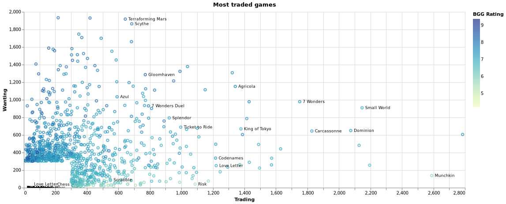
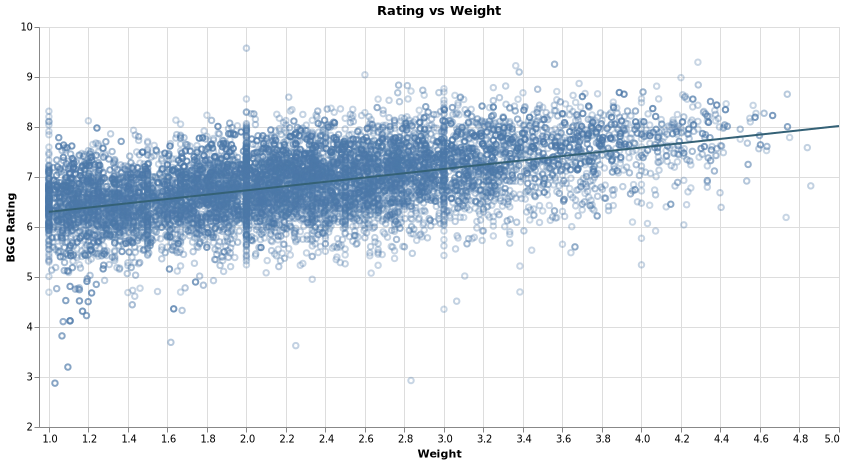
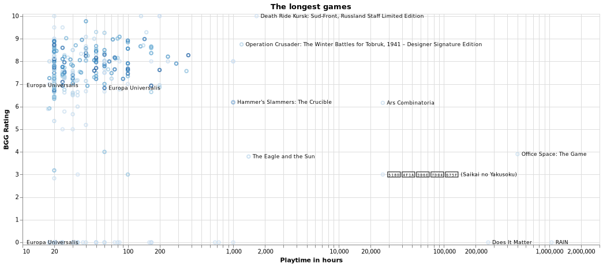
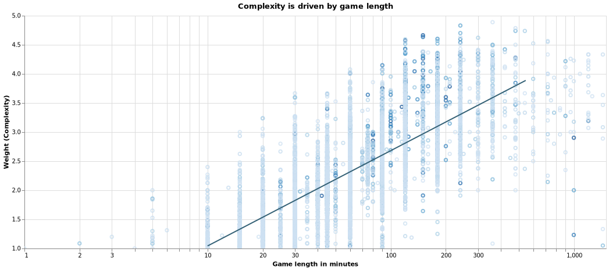
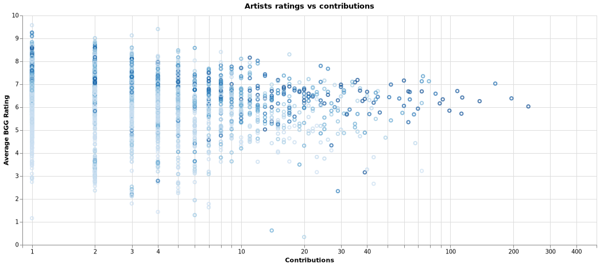
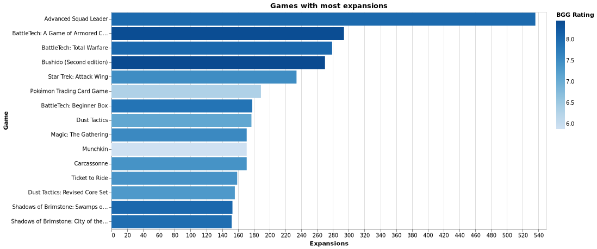

# Board game analysis

Data + this guy is on vacation = Analysis!

Click on any of the charts for the interactive versions with tooltips! Ooooh... tooltips...!

## What are the best games out there?

The definition of "Best game" is not as easy to define as one would hope. A simple rating sort would inevitably put some barely rated games very high, not to mention the fact that expansions and newer editions tend to be better rated than the base games. I strived to aproximate the best game metric, by observing metrics such as best rated and most wished.

## Wished vs owned?

I chose most wished, but owned could also be on that list. Intuitively, the game everybody has, would surely be the best game out there, right? 

The problem with owned games is that a game doesn't have to be good for people to put it on their owned list. In my analysis I wanted to check what people want to have, rather than what they own. This leaves out from the analysis omni-present games like Uno, Scrabble and Monopoly. 

A problem with the wished definition is that it is biased towards expensive games. It's more likely for people to put expensive games on their wishlist than games that they can simply just go and buy. To give an example, Too many bones sits at approx 8k owned which makes it an averagely owned game (of the games with at least 100 owned copies), but with a near equal amount of presence on the wishlist with around 6k copies, it makes it one of the top wished for games.

## Which games have the most skewed trading/wanting ratio?

## Are more difficult games higher rated?

## What are the best games depending on number of players?
The hell was the North African campaign game for 10 people...

## Playtime analysis
### What are the best games base on playing time?

Sometimes there's a need for easier and quicker games. Mostly these are referred to filler games as they could be played as a side to the main game of the evening.

- [The Crew](https://www.youtube.com/watch?v=D7efIcZFMp8) looks amazing!
- [Inhuman conditions](https://www.youtube.com/watch?v=pLR6yGVJs0Y) 
- [KLASK](https://www.youtube.com/watch?v=ZTpPzAzzwyU) looks super entertaining although maybe looks more like a toy?

### What are the longest games?
The longest game that seems to have some support is the same masterpiece as the one for 10 people from before with a whooping 1000 hours of estimated playtime.

Most of these games are part of the Advanced Squad Leader (ASL).
It's hard to take seriously most of the rest of the games on this list, alas, here it is. And if someone asks you how long is the longest game on bgg.. well it's half a million hours long.

### Is there a connection between playtime and complexity?
https://boardgamegeek.com/wiki/page/Weight

## Who are the best designers, artists, publishers? Who produced the most?

### Artists
Artist with most stuff / highest ratings

### Designers

### Publishers

## What are the most and least common categories? What are the best games per category?

For example, I found
- an interesting story driven pirates game: [Forgotten Waters](https://boardgamegeek.com/boardgame/302723/forgotten-waters)
- Or this religious beauty: [Virgin Queen](https://www.youtube.com/watch?v=86pIbGeBJPQ)

Having checked negotiation games and found out about [Dune](https://www.youtube.com/watch?v=O6BKjk_2UTE) which looks like a jewel and having watched the linked video about it, we found out about [War of the Ring](https://www.youtube.com/watch?v=MvgooNB8Ck0) which seems like an awesome 2 player war game.

Under the Maze category we found [Burgle Bros](https://www.youtube.com/watch?v=XLeYbGKf0aY) which might be an awesome Co-op game!

A party game that sparked my attention was [Deception: Hong Kong](https://www.youtube.com/watch?v=CDWvHrt6kG0) and [The Resistance: Avalon](https://www.youtube.com/watch?v=rXlK3NZjLGc) looks very sneaky.
I've played [Just one](https://www.youtube.com/watch?v=PG5QE_YUw1E) and [Monikers](https://www.youtube.com/watch?v=yvdpPc5ZVlE) before, but didn't catch their names, so this research helped me with that!

## What are the most common mechanics? What are the best games per mechanic?

[The King's Dilemma](https://www.youtube.com/watch?v=XaTHH7xDRqE) sticks out to me in the negotiation games (which seems to be both a mechanic and a category..). It's a legacy game for 5 people where you fight over a kingdom!

## Which games have the most expansions?
Carcassone? Bang? Magic the Gathering?
Well.. sort of, but they are shadowed by games like Advanced Squad Leader with a whooping 456 expansions.

### Highest by year

## Dice Tower Certificate of Excellence and Shut up & Sit Down Recommendations

---

# Appendix

## What's a game?
Most of the quantitative numbers focused on number of games. But it's not the easiest decision to make what should consist of a game.
My assumptions:
- I decided that I don't count expansions, they are part of the same game.
- I don't count different editions, they are the same game.
- I don't count reimplementations where I managed to identify these.
- When there was a family of games, I only took the most popular (the one with the most `usersratings`) as I considered that to be the flagship of the games. This allowed me to drop various spin-offs of the same game.
- In many of the stats I also did a cut of games that either had a certain amount of ratings or that were wished by at least a certain amount of people. The goal here is to weed out games that are either too new or not relevant enough to count as statistics. Apologies if your very niche game did not appear where you wanted to see it, but already with these the charts were massive.

## Possible additional analysis
- Which games have the most implementations?
- Most diverse creators (most different categories/mechanics x ratings per creator)
    - combo? artists that worked with most designers, publishers?

